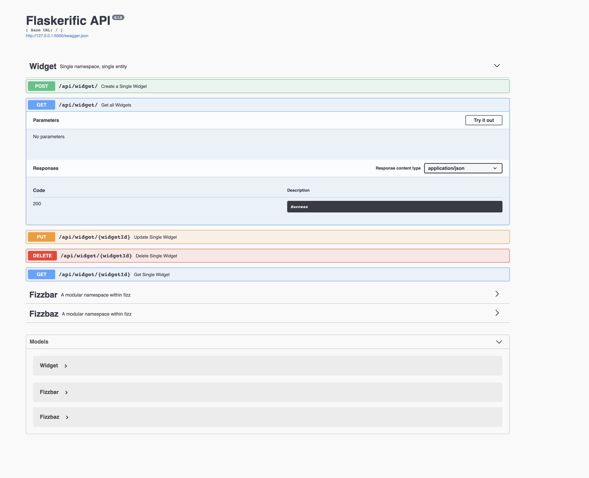

# Example of a scalable Flask API



A sample project showing how to build a scalable, maintainable, modular Flask API with a heavy emphasis on testing.

_This is an example project using the structure proposed in [this blog post](http://alanpryorjr.com/2019-05-20-flask-api-example/)._


## Running the app

Preferably, first create a virtualenv and activate it, perhaps with the following command:

```
virtualenv -p python3 venv
source venv/bin/activate
```

Next, run

```
pip install -r requirements.txt
```

to get the dependencies.

### Manage the database

Explicitely set the environment (```dev``` ,```prod``` and ```test```) 
```
export FLASK_CONFIG=dev
```

Next, initialize the database

```
python manage.py seed_db
```

Type "Y" to accept the message (which is just there to prevent you accidentally deleting things -- it's just a local SQLite database)


### Run the app for local development

The following command is a shorthand for running the development server
```
python dev.py
```


## Running tests

To run the test suite, simply pip install it and run from the root directory like so

```
pip install pytest
pytest
```


### Deploy the app in production

##### Folder settup

On the server, create the project folder

```
mkdir /var/www/flask_api_example
```

In the project folder, create a python virtual environment
```
python -m venv ven
```

Install the python packages requirements
```
pip install -r requirements.txt
```

Initialize the DB (or paste an existant one)
```
python migrate.py seed_db
```

##### Proxy setting 

If needed to, allow the folder access to the server user that will have control the app
```
sudo chown -Rf <admin>:<group> /var/www/flask_api_example/
```

Navigate to the posted URL in your terminal to be greeted with Swagger, where you can test out the API.
